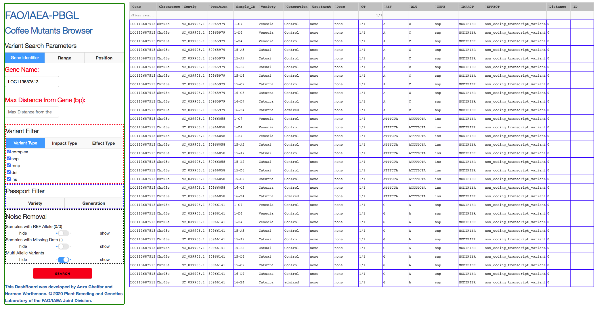

#########################
Mutants Browser DashBoard
#########################
of the `Plant Breeding and Genetics Laboratory, FAO/IAEA Joint Division <http://www-naweb.iaea.org/nafa/pbg/index.html>`_

.. image:: https://img.shields.io/badge/python-3.5-blue
    :target: https://www.python.org

.. image:: https://img.shields.io/badge/Bioconda-up%20todate-brightgreen
    :target: https://bioconda.github.io/

.. image:: https://img.shields.io/badge/SnpSift-4.3.1t-blue
    :target: http://snpeff.sourceforge.net/

.. image:: https://img.shields.io/badge/SnpEff-4.5covid19-blue
    :target: http://snpeff.sourceforge.net/

.. .. raw:: html
          

*******
Purpose
*******

This DashBoard provides a search interface for DNA variation. The intended purpose is a searchable catalogue of mutations and mutant individuals that is queried by genes-of-interest or chromosome/position ranges. 
The user will need to provide a bcf/vcf file generated by SnpEff (http://snpeff.sourceforge.net/). 
The DashBoard will use the annotation information from this file. We provide a parser that will generate the data tables that the DashBoard will need. The user can add passport information to the individuals and custom chromosome identifiers. 

-----------------
For the impatient
----------------- 

.. code-block:: bash

    $ conda env create -f envs/condaenv.yaml
    $ conda activate Dashboard
    $ bash utils/vcf_to_datatables.sh ../input.snpeff.vcf.gz 
    $ python mutants_dashboard.py 

************************
Setting up the DashBoard
************************

--------------------------------
Installing the conda environment
--------------------------------

The DashBoard will need to run in a conda environment. 

Create the environment defined in **envs/condaenv.yaml** like so:

.. code-block:: bash

    $ conda env create -f envs/condaenv.yaml

Once created, activate the environment **Dashboard** like so:

.. code-block:: bash  

    $ conda activate Dashboard

-------------------------
Creating the data tables
-------------------------

Prerequisite is a vcf/bcf file that has been run through SnpEeff to annotate the variant's effects (http://snpeff.sourceforge.net/). 
On such annotated vcf/bcf file run the parser script like so:

.. code-block:: bash

    $ bash utils/vcf_to_datatables.sh <path to input snpeff vcf/bcf>

This will generate all required data tables.

* snpsiftdata.tab
* genotype_data.tab
* passport.tab
* chromosome_name_mapping.tab

The user now has the option to edit **passport.tab** in order to add details to individual samples. In **chromosome_name_mapping.tab** custom chromosome identifiers can be provided in the "Chromosome" column. 
Note that subsequent runs of the parser (**vcf_to_datatables.sh**) will overwrite the existing files in ./data. Details on how the tables are generated can be found further below.

----------------------
Creating the Dashboard
----------------------

With the data tables generated and in **./data**, run the following command to create the DashBoard:

.. code-block:: bash

    $ python mutants_dashboard.py

Upon startup the dashboard will report where its running:

.. code-block:: bash

    Running on http://127.0.0.1:8050/
    Debugger PIN: 383-685-305
    * Serving Flask app "mutants_dashboard" (lazy loading)
    * Environment: production
    WARNING: This is a development server. Do not use it in a production deployment.

In the above/standard case, point your browser to URL **http://127.0.0.1:8050/** to view the DashBoard.
The DashBoard's display name can be configured by editing the "institution" and "tool" variables in **mutants_dashboard.py**.   

.. _Details on generating the data tables:

*************************************
Details on generating the data tables
*************************************

We kept the extraction of relevant information from the vcf/bcf file into the data tables quite simple and use only standard software tools.
All commands are executed when running **./utils/vcf_to_datatables.sh**. We provide details below for transparency. 
The commands are easily tested and adjusted to meet specific needs. Example data tables are provided in **./data_example** for reference. 

-------------
SnpSift Data (snpsiftdata.tab)
-------------

This file is created from the <inputfile.vcf/bcf> by **utils/vcf_to_datatables.sh** like so:

.. code-block:: bash

    bcftools view <inputfile.vcf/bcf> | grep -v "start_retained_variant" | \
    $CONDA_PREFIX/share/snpsift-*/scripts/vcfEffOnePerLine.pl | \
    SnpSift extractFields -e "NA" - "ANN[*].GENE" "ANN[*].DISTANCE" CHROM POS ID REF ALT TYPE "ANN[*].IMPACT" "ANN[*].EFFECT" "ANN[*].FEATURE" "ANN[*].FEATUREID" "ANN[*].BIOTYPE" "ANN[*].RANK" \
    > data/snpsiftdata.tab

It uses snpEff/SnpSifts own functionality and scripts to extract the relevant annotation and effect information per variant.
We are excluding lines containing "start_retained_variant", because the most recent SnpSift version we used (4.3.1t) does not seem to understand this effect type.

---------------------------------
Genotype Data (genotype_data.tab)
---------------------------------

This file is created from the <inputfile.vcf/bcf> by **utils/vcf_to_datatables.sh** like so:

.. code-block:: bash

    CHROM_POS=$(printf "CHROM\\tPOS\\t");
    SAMPLE_NAMES=$(bcftools query -l <inputfile.vcf/bcf> | paste -s -d "\t" -)
    echo "$CHROM_POS$SAMPLE_NAMES"> data/genotype_data.tab
    bcftools view <inputfile.vcf/bcf> | bcftools query -f "%CHROM\t%POS[\t%GT]\n" >> data/genotype_data.tab

It simply extracts genotypes for all samples at all variant Chromosome/Positions. 

----------------------------
Passport Data (passport.tab)
----------------------------

This table is initially populated with the sample names found in the vcf/bcf file in the "Sample-ID" column and "NA" in each of the data columns. 

.. code-block:: bash

    printf "Sample-ID\\tPlant-ID\\tBranch-ID\\tVariety\\tGeneration\\tTreatment\\tDose\n" > data/passport.tab
    a=$(bcftools query -l <inputfile.vcf/bcf>)
    b="\tNA\tNA\tNA\tNA\tNA\tNA"
    for i in ${a[*]}; do
       echo -e $i$b >> data/passport.tab;
    done

The user has the option to edit this file and replace respective "NA"s with relevant information for each of the samples. 
"Sample-ID" is the primary key and must not be edited. Llines must not be removed.

Example **passport.tab** file (after manual editing):

      +-----------+-------------+-----------+-----------+------------+------------+--------+
      | Sample-ID | Plant-ID    | Branch-ID | Variety   | Generation | Treatment  | Dose   | 
      +===========+=============+===========+===========+============+============+========+
      | 1-C7      | Ca-2018-021 | NA        | Venetia   | M0         | Control    | NA     |
      +-----------+-------------+-----------+-----------+------------+------------+--------+
      | 1-D4      | Ca-2018-025 | NA        | Venetia   | M1         | EMS        | 2%     |
      +-----------+-------------+-----------+-----------+------------+------------+--------+
      | 1-E2      | Ca-2018-030 | NA        | Venetia   | M1         | Gamma      | 50 Gy  |
      +-----------+-------------+-----------+-----------+------------+------------+--------+

-----------------------------------------------------
Chromosome Name Mapping (chromosome_name_mapping.tab)
-----------------------------------------------------

This file is created from the <inputfile.vcf/bcf> by **utils/vcf_to_datatables.sh** like so:

.. code-block:: bash

    printf "Contig\\tChromosome\n" > data/chromosome_name_mapping.tab
    bcftools view -h <inputfile.vcf/bcf> | grep "##cont"| \
    awk -F "=|," '{print $3 "\t" $3}' >> data/chromosome_name_mapping.tab

The chromosome names are extracted from the vcf/bcf file and recorded twice (in 2 columns), as "Contig" and "Chromosome".
The "Contig" column must remain unchanged. The user has the option of mapping the "Contig" names to custom chromosome identifiers by editing the "Chromosome" column.

-------------------------
Customising the Dashboard
-------------------------

The Dasboard's name, displayed in the upper left corner, is easily customised by changing the variables **institution** and **tool**.

.. code-block:: python

    institution='FAO/IAEA-PBGL'
    tool='Coffee Mutants Browser'

----------
Deployment
----------

There are twe modes of deployment. On localhost or via the internet. They are mutually exclusive and when changing the code make sure the correct lines are commented/uncommented:

For a local/development deployment edit mutants_dashboard.py and make sure that the correct lines are present/uncommented:

.. code-block:: python

    ###########################################
    ## production mode
    #import flask
    #server = flask.Flask(__name__)
    #app = dash.Dash(__name__, server=server)

    ## then invoke the tool in the server like so:
    ## gunicorn mutants_dashboard:server -b :8000

    ############################################
    ## local/devlopment mode
    app = dash.Dash(__name__)

then invoke the tool on localhost like so

.. code-block:: python 

    python mutants_dashboard.py

For Internet/Production Deployment: In mutants_dashboard.py make sure that these lines are present/uncommented:

.. code-block:: python 

    ###########################################
    ## production mode
    import flask
    server = flask.Flask(__name__)
    app = dash.Dash(__name__, server=server)

    ############################################
    ## local/devlopment mode
    #app = dash.Dash(__name__)

Then invoke the tool in the server. For example like so:

.. code-block:: python 

    gunicorn mutants_dashboard:server -b :8000

For local/devlopment mode

*********************
Usage
*********************

------------------------
Search, filter, and sort
------------------------

Starting point is either a gene name, a chromsome/position, or a chromosome/position range. Select the appropriate tab, enter the desired values and click "SEARCH".
If desired, the results can already be filtered at the start. Reasonable defaults are preselected. 
The results will appear as a table and can be further sorted (by clicking on the arrows in the header line) or sub-selected (by entering the respective value in the 2nd line and hitting enter).
If nothing is found, a respective message is displayed. If no such message is displayed, yet no table is shown, do not hesitate to hit "Search" again.
 

--------------
Result Columns
--------------

Most columns are self-explanatory. **Sample** refers to the sample name in the vcf file and the additional information on the sample is drawn from the passport.tab file that the user can customise. 
The alleles are given as **REF** and **ALT**, denoting the reference allele and the alternative allele (= variant/mutation). 
Genotypes are 0/0 for homozygous reference, 1/1 for homozygous variant, and 0/1 for hetero-/hemi-zygous. 
Additional allele classes are possible for multi-allelic variants, denoting the respective alternative allele (e.g., 0/2, etc).

**Impact** and **Effect** are displayed as recorded in the vcf file by SnpEff; as is the **Distance** to the gene, where 0 means that the variant lies within the gene. 
**ID** refers to the ID column in the vcf file, and will be empty if this column had not been filled upstream.

*********************
Copyright information
*********************

This Dashboard was developed by Anza Ghaffar and Norman Warthmann, 
© 2020 `Plant Breeding and Genetics Laboratory of the FAO/IAEA Joint Division <http://www-naweb.iaea.org/nafa/pbg/index.html>`_.
If you find this DashBoard useful and want to use in in your own research, please get in touch by emailing
n.warthmann@iaea.org. We are happy to provide an annotated vcf/bcf to help you get started.

